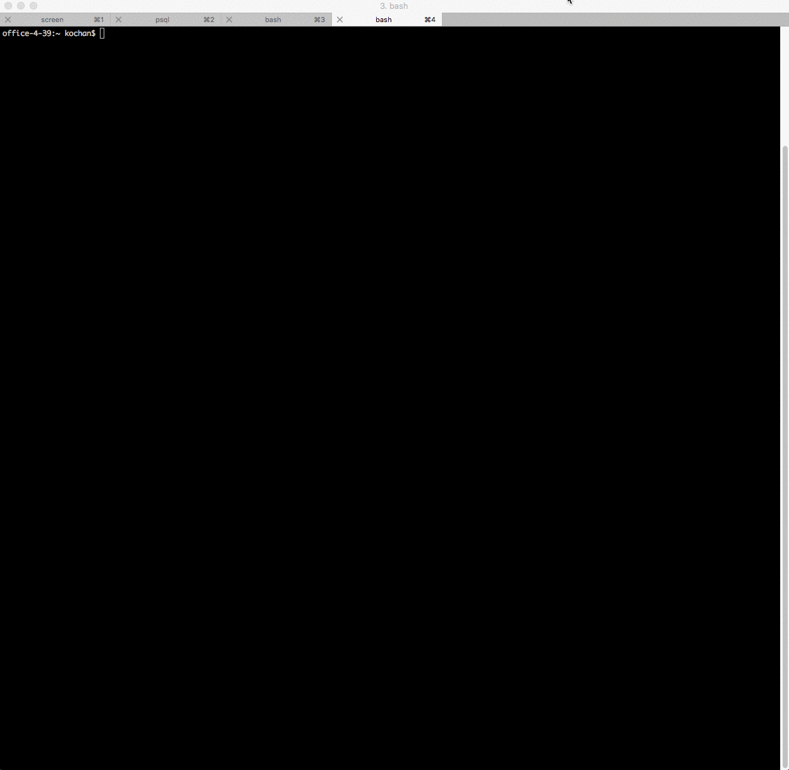
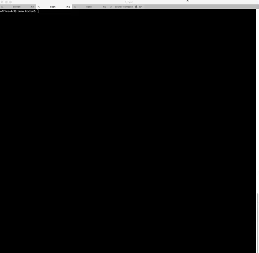
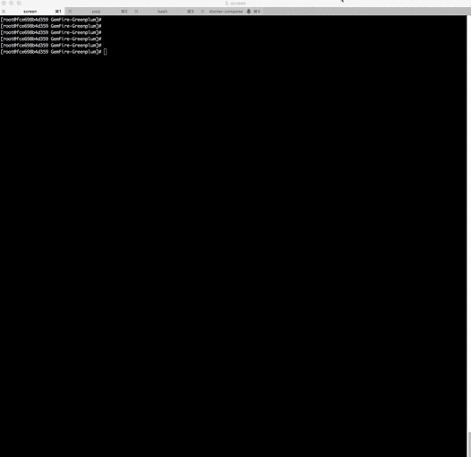
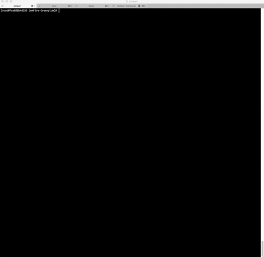

<!--
Licensed to the Apache Software Foundation (ASF) under one or more
contributor license agreements.  See the NOTICE file distributed with
this work for additional information regarding copyright ownership.
The ASF licenses this file to You under the Apache License, Version 2.0
(the "License"); you may not use this file except in compliance with
the License.  You may obtain a copy of the License at

     http://www.apache.org/licenses/LICENSE-2.0

Unless required by applicable law or agreed to in writing, software
distributed under the License is distributed on an "AS IS" BASIS,
WITHOUT WARRANTIES OR CONDITIONS OF ANY KIND, either express or implied.
See the License for the specific language governing permissions and
limitations under the License.
-->

# GemFire-Greenplum connector with partitioned region example

This screencast shows how to get started with GemFire-Greenplum connector.

You can configure and setup this demo in 15 minutes.

# Assumptions
* Assumes docker-compose and git are preinstalled.

* Download GemFire-Greenplum connector from https://network.pivotal.io/products/pivotal-gemfire.  The gemfire-greenplum-3.0.0.jar should be copied to ```geode-examples/GemFire-Greenplum/```

## Demonstration of GemFire-Greenplum connector
1) Clone this example from github



2) Download GemFire-Greenplum connector from Pivotal network


3) Copy GemFire-Greenplum connector jar to "Geode-examples/GemFire-Greenplum" folder.
Next, run the docker-compose to download and run docker-compose


4) Run this command to setup GPDB database




5) Start GemFire locator and servers



6) Run import operation to transfer data from Greenplum into GemFire


7) Run export operation to transfer data from GemFire into Greenplum


